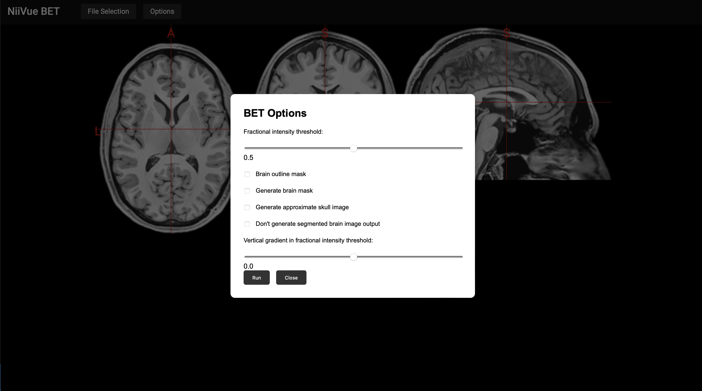
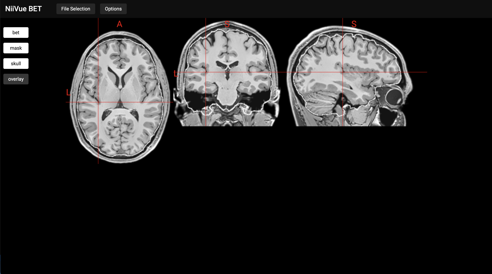

# NiiVue + BET

Integration of the [WASM port](https://github.com/wpmed92/WebMRI) of FSL [BET](https://fsl.fmrib.ox.ac.uk/fsl/fslwiki/BET) into [NiiVue](https://github.com/niivue/niivue)

## Build

This examples uses [Vite](https://vitejs.dev)
To run:
`npm run dev`

## Usage

The demo loads a test nifti file. If you want to use your own file, click on "File selection".
To invoke BET, click on "Options", tune the parameters to your liking, than click "Run".

The output volumes generated by BET are accessible by the overlay buttons on the left side of the canvas.

## License

BSD 2-Clause License
